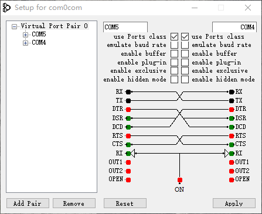
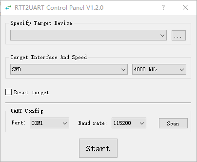
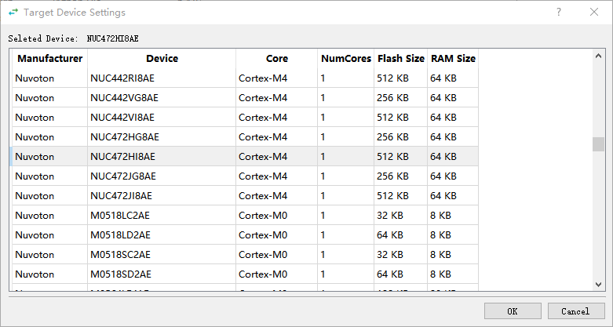
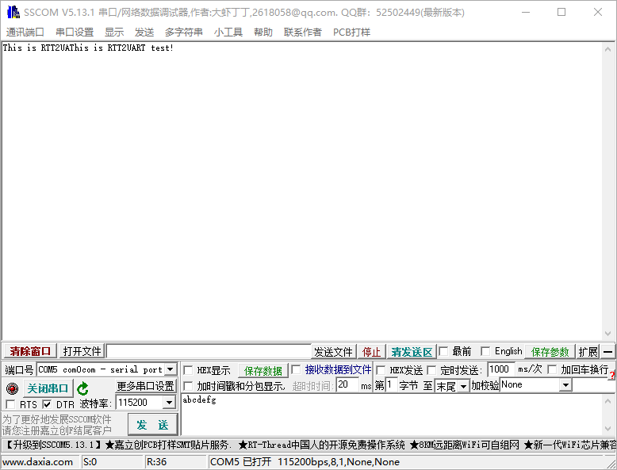
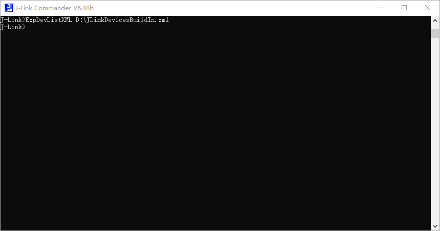

# RTT2UART

***Note: Installed a virtual serial port tool like [com0com](http://com0com.sourceforge.net/) before use this tool !***

## How to use

* Step1: selete the device and click *OK*

   
* Step2: config the target interface and speed
* Step3: tick the *Reset target* option will reset the target once connected
* Step4: scan then selete the ***virtual COM port*** like *com4* and baud rate
* Step5: click start to connect the target
* Step6: selete another com port of the com port pair like *com5*

## Update the device lists

if can't find the device you want, follow the picture below and replace the ***JLinkDevicesBuildIn.xml*** file in the path of this tool.

